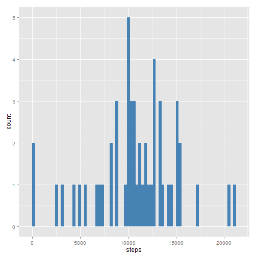
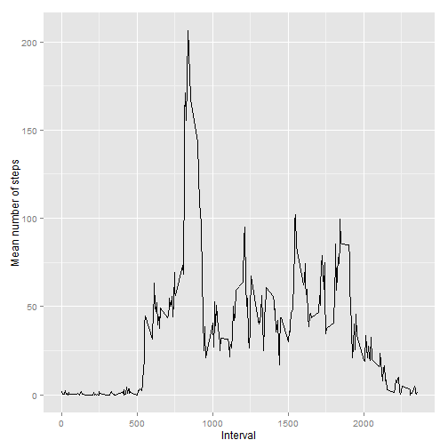
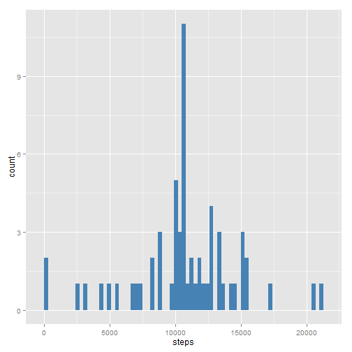
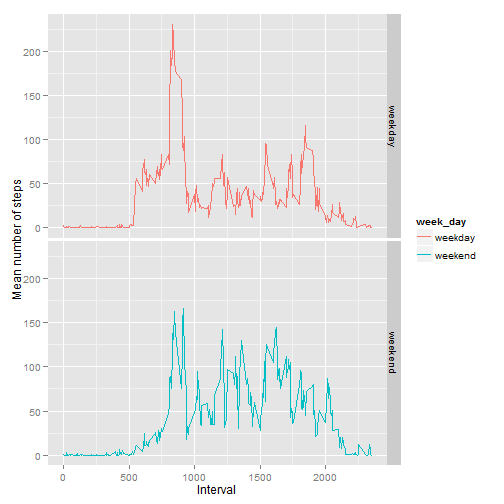

# Reproducible research: assignment 1

As a first step, we have loaded the packages we need, set the correct locale, loaded the data, verified the structure of the data and transformed the dates to the correct format.  


```r
library(plyr)
library(ggplot2)
Sys.setlocale("LC_TIME", "English_United States.1252") 
```

```
## [1] "English_United States.1252"
```

```r
unzip("repdata_data_activity.zip")
activity <- read.csv("activity.csv", stringsAsFactors = FALSE)
str(activity)
```

```
## 'data.frame':	17568 obs. of  3 variables:
##  $ steps   : int  NA NA NA NA NA NA NA NA NA NA ...
##  $ date    : chr  "2012-10-01" "2012-10-01" "2012-10-01" "2012-10-01" ...
##  $ interval: int  0 5 10 15 20 25 30 35 40 45 ...
```

```r
summary(activity)
```

```
##      steps           date              interval   
##  Min.   :  0.0   Length:17568       Min.   :   0  
##  1st Qu.:  0.0   Class :character   1st Qu.: 589  
##  Median :  0.0   Mode  :character   Median :1178  
##  Mean   : 37.4                      Mean   :1178  
##  3rd Qu.: 12.0                      3rd Qu.:1766  
##  Max.   :806.0                      Max.   :2355  
##  NA's   :2304
```

```r
activity$date <- as.Date(activity$date)
```


In the next step, we sum the total number of steps taken each day, and make a histogram representing
the distribution of steps per day. We also calculate the mean and median total number of steps taken per day, ignoring
missing values. 


```r
activity_tot <- aggregate(activity$steps, by = list(activity$date), FUN = sum )
names(activity_tot) <- c("date","steps")
p <- ggplot( activity_tot, aes (x= steps))
p + geom_histogram(binwidth = 300, fill = "steelblue") 
```

 

```r
mean_steps <- mean(activity_tot$steps , na.rm = TRUE)
med_steps <- median(activity_tot$steps, na.rm = TRUE)
```

The mean number of steps is thus equal to 1.0766 &times; 10<sup>4</sup> while the median is 10765.

Next, we calculate the average number of steps per 5-minute interval (averaged over all days), ignoring missing values.
We represent this as a time series plot.


```r
activity_int <- aggregate(activity$steps, by = list(activity$interval), FUN = mean , na.rm = TRUE )
names(activity_int) <- c("interval", "mean_number_of_steps")
qplot(interval,  mean_number_of_steps, xlab = "Interval", ylab = "Mean number of steps", data = activity_int, geom = "line")
```

 

```r
max_inter <- activity_int[activity_int$mean_number_of_steps == max(activity_int$mean_number_of_steps)   , "interval"  ]
```

On average, accross all the days in the dataset, the 835th interval contains the maximum number of steps.

In total, there are 2304 rows with missing values in the 
original data set. Therefore, we create a new variable, "steps_noNA", which is equal to the
original number of steps per period and day if available, or the average per interval accross
all days if not. 


```r
activity_noNA <- ddply(activity,  .(interval), transform, steps_noNA = ifelse(is.na(steps), mean(steps, na.rm = TRUE) , steps)  )
summary(activity_noNA)
```

```
##      steps            date               interval      steps_noNA   
##  Min.   :  0.0   Min.   :2012-10-01   Min.   :   0   Min.   :  0.0  
##  1st Qu.:  0.0   1st Qu.:2012-10-16   1st Qu.: 589   1st Qu.:  0.0  
##  Median :  0.0   Median :2012-10-31   Median :1178   Median :  0.0  
##  Mean   : 37.4   Mean   :2012-10-31   Mean   :1178   Mean   : 37.4  
##  3rd Qu.: 12.0   3rd Qu.:2012-11-15   3rd Qu.:1766   3rd Qu.: 27.0  
##  Max.   :806.0   Max.   :2012-11-30   Max.   :2355   Max.   :806.0  
##  NA's   :2304
```

As previously, we sum the total number of steps taken each day, and make a histogram representing
the distribution of steps per day with the missing filled in. We also calculate the mean and median total number of steps taken per day, ignoring
missing values. 


```r
activity_tot_noNA <- aggregate(activity_noNA$steps_noNA, by = list(activity_noNA$date), FUN = sum  )
names(activity_tot_noNA) <- c("date","steps")
g <- ggplot( activity_tot_noNA, aes (x= steps))
g + geom_histogram(binwidth = 300, fill = "steelblue") 
```

 

```r
mean_steps_noNA <- mean(activity_tot_noNA$steps, na.rm = TRUE)
med_steps_noNA <- median(activity_tot_noNA$steps, na.rm = TRUE)
```

The mean number of steps is now equal to 1.0766 &times; 10<sup>4</sup> while the median is 1.0766 &times; 10<sup>4</sup>: replacing missing values by the averages of observed values does not change the mean, but does affect the median because the total number of observations has now changed. 

Without imputing missing values, the total number of daily steps was 570608. After imputation of the missing values, the imputed total number of daily steps is 6.5674 &times; 10<sup>5</sup>. It has thus increased by 8.613 &times; 10<sup>4</sup>.

Finally, we identify the day of the week for each observation, and create a factor variable
"week_day", representing whether it is a weekday or a weekend date. We calculate the average number 
of steps per interval, distinguishing between weekdays and weekends. Finally, we represent this graphically. 


```r
activity_noNA$day_name <- weekdays(activity_noNA$date)
weekends <- c("Saturday","Sunday")
activity_noNA$week_day <- ifelse(activity_noNA$day_name %in% weekends, "weekend","weekday" )
activity_noNA$week_day <- as.factor(activity_noNA$week_day)
activity_noNA_int <- aggregate(activity_noNA$steps_noNA, by = list(activity_noNA$interval,activity_noNA$week_day), FUN = mean  )
names(activity_noNA_int) <- c("interval", "week_day", "mean_number_of_steps")
qplot(interval, mean_number_of_steps, xlab= "Interval", ylab = "Mean number of steps", data = activity_noNA_int, facets = week_day ~ ., geom = "line", color = week_day)  
```

 
